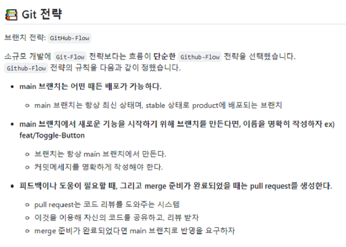

# 📝 원티드 프리 온보딩 4주차 과제 - 라쿠텐심포니코리아


## 📌배포 링크

- [배포링크](https://youthful-northcutt-6990e7.netlify.app/)

## 📌프로젝트 소개

- 

## 📌기술 스택

 

## 📌팀원 소개

<table align="center">
<tr >
<td align="center"><a href="https://github.com/perfumelim"></a></td>
<td align="center"><a href="https://github.com/kykim00"></a></td>
<td align="center"><a href="https://github.com/yezyvibe"></a></td>
</tr>
<tr>
<td align="center"><b> 임향수 (팀장)</b></td>
<td align="center"><b>김기영</b></td>
<td align="center"><b>조예지</b></td>
</tr>
<tr>
<td align="center"><b>FE Developer</b></td>
<td align="center"><b>FE Developer</b></td>
<td align="center"><b>FE Developer</b></td>
</tr>
</table>


## 📌프로젝트 과정 소개

- github-actions를 통해서 pulll request 시 assignee, reviewer를 자동 지정하도록 자동화 작업 수행하였습니다.

|     🚥Git 커밋 컨벤션 정의     |           🔰코딩 컨벤션 약속을 통한 코드 통일성           |
| :---------------------------: | :------------------------------------------------------: |
|  |  |


### ✔ 담당자 : 김기영 🐶

* 링크 아이템을 클릭하여 상세페이지로 이동합니다.
* 파일 관련 기능 구현
  * 파일 개수의 숫자에 3자리 단위마다 콤마를 표시합니다.
  * 파일 사이즈를 읽을 수 있도록 표시해주세요.
    - 소수점 둘째 자리까지 표기합니다.
    - 단위는 숫자 뒤에 B, KB, MB, GB, TB로 표기 (ex. 10.86KB)
  * 받은 사람이 있을 경우 받은 사람 텍스트를 미리 주어진 코드베이스와 같이 컴포넌트를 이용합니다.

### ✔ 담당자 : 임향수 🐱

- 링크 상세 화면 : 링크 목록 화면에서 해당 링크 클릭시 상세 화면에서 링크 정보 출력하고 받기 버튼 클릭시 alert
  * 링크가 가지고 있는 파일 목록을 확인하고 공유 받을 수 있습니다.
  * 기능
    - 링크 정보를 표시합니다.
    - 받기 버튼을 누르면 다운로드 되었습니다.를 내용으로 가지는 브라우저 기본 Alert을 표시합니다.
    - 링크의 유효기간이 만료 되지 않았을 경우에만 파일 목록을 표시합니다.
  * 클릭한 링크의 key값을 params로 받아 동적라우팅을 구현했습니다.

### ✔ 담당자 : 조예지🐰

- 링크 목록 화면 :

  - 유효기간 관련 기능 구현
    - 제목 아래 URL을 아래와 같이 표시합니다.
      - 유효기간 이내: 도메인 주소를 포함한 상세페이지로 이동하는 전체경로를 표시합니다.
      - 유효기간 만료: 만료됨으로 표시합니다.
    - URL을 클릭한 경우 아래와 같이 동작합니다.
      - 유효기간 이내: URL를 클립보드에 복사하고 ${링크 제목} 주소가 복사 되었습니다.를 내용으로 가지는 브라우저 기본 Alert을 표시합니다.
      - 유효기간 만료: 아무동작도 하지 않습니다.
    - 유효기간을 아래와 같이 표시하되 실시간으로 반영합니다.
      - 48시간 미만: XX시간 XX분
      - 48시간 이상: X일
      - 만료: 만료됨

  

## 📌구현 상세 내용 참고

- 현재 시각을 기준으로 하면 주어진 데이터가 모두 만료한 url이기 때문에 "만료됨" 또는 남은 유효기간을 확인하기 위해 기준이 되는 임시 날짜값을 today변수로 할당하여 데이터를 출력했습니다. 

- svg 관련 내용 추가

- 날짜 변환 관련 내용 추가

  

## 📌프로젝트 설치 및 시작

### 프로젝트 클론

```
$ git clone https://github.com/2201infinity/rakuten.git
```

### 패키지 설치

```
$ yarn
```

### 서버 실행

```
$ yarn start
```

